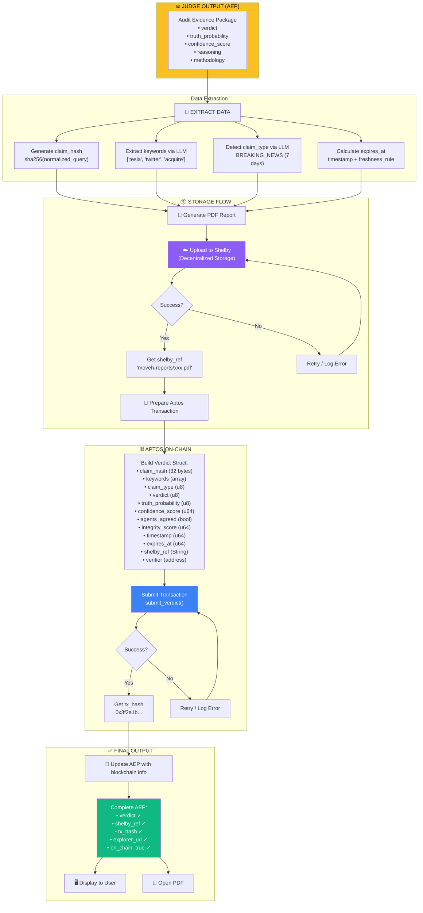

```mermaid
flowchart TD
    subgraph JUDGE["⚖️ JUDGE OUTPUT (AEP)"]
        AEP["Audit Evidence Package
        • verdict
        • truth_probability
        • confidence_score
        • reasoning
        • methodology"]
    end

    AEP --> EXTRACT["🔑 EXTRACT DATA"]
    
    subgraph EXTRACT_PROCESS["Data Extraction"]
        EXTRACT --> E1["Generate claim_hash
        sha256(normalized_query)"]
        EXTRACT --> E2["Extract keywords via LLM
        ['tesla', 'twitter', 'acquire']"]
        EXTRACT --> E3["Detect claim_type via LLM
        BREAKING_NEWS (7 days)"]
        EXTRACT --> E4["Calculate expires_at
        timestamp + freshness_rule"]
    end

    E1 --> PDF
    E2 --> PDF
    E3 --> PDF
    E4 --> PDF

    subgraph STORAGE["📦 STORAGE FLOW"]
        PDF["📄 Generate PDF Report"]
        PDF --> SHELBY["☁️ Upload to Shelby
        (Decentralized Storage)"]
        
        SHELBY --> SHELBY_SUCCESS{Success?}
        SHELBY_SUCCESS -->|Yes| GET_REF["Get shelby_ref
        'moveh-reports/xxx.pdf'"]
        SHELBY_SUCCESS -->|No| RETRY_SHELBY["Retry / Log Error"]
        RETRY_SHELBY --> SHELBY
        
        GET_REF --> PREPARE_TX["🔗 Prepare Aptos Transaction"]
    end

    subgraph APTOS_TX["⛓️ APTOS ON-CHAIN"]
        PREPARE_TX --> BUILD["Build Verdict Struct:
        • claim_hash (32 bytes)
        • keywords (array)
        • claim_type (u8)
        • verdict (u8)
        • truth_probability (u8)
        • confidence_score (u64)
        • agents_agreed (bool)
        • integrity_score (u64)
        • timestamp (u64)
        • expires_at (u64)
        • shelby_ref (String)
        • verifier (address)"]
        
        BUILD --> SUBMIT["Submit Transaction
        submit_verdict()"]
        
        SUBMIT --> TX_SUCCESS{Success?}
        TX_SUCCESS -->|Yes| GET_TX["Get tx_hash
        0x3f2a1b..."]
        TX_SUCCESS -->|No| RETRY_TX["Retry / Log Error"]
        RETRY_TX --> SUBMIT
    end

    GET_TX --> UPDATE_AEP["📝 Update AEP with blockchain info"]
    
    subgraph FINAL["✅ FINAL OUTPUT"]
        UPDATE_AEP --> FINAL_AEP["Complete AEP:
        • verdict ✓
        • shelby_ref ✓
        • tx_hash ✓
        • explorer_url ✓
        • on_chain: true ✓"]
        
        FINAL_AEP --> DISPLAY["🖥️ Display to User"]
        FINAL_AEP --> OPEN_PDF["📄 Open PDF"]
    end

    style JUDGE fill:#fbbf24,color:#000
    style SHELBY fill:#8b5cf6,color:#fff
    style SUBMIT fill:#3b82f6,color:#fff
    style FINAL_AEP fill:#10b981,color:#fff
```