# 🔍 Agent 1: The Fact Checker

Verifies claims by searching authoritative sources and analyzing evidence.

## Workflow Diagram

```mermaid
flowchart TB
    subgraph INPUT["📥 INPUT"]
        claim["🎯 Claim to Verify"]
    end

    subgraph STRATEGIST["🧠 STRATEGIST NODE"]
        direction TB
        s1["Analyze Claim"]
        s2["Generate 3 Search Queries"]
        s3["Target: Official Sources,<br/>News Outlets, Historical Data"]
        s1 --> s2 --> s3
    end

    subgraph EXECUTOR["⚡ EXECUTOR NODE"]
        direction TB
        e1["Async Parallel Search"]
        subgraph TAVILY["Tavily API (Parallel)"]
            t1["Query 1"]
            t2["Query 2"]
            t3["Query 3"]
        end
        e2["Cache Results (MD5)"]
        e3["Format: title, url, content, score"]
        e1 --> TAVILY --> e2 --> e3
    end

    subgraph ANALYST["📊 ANALYST NODE"]
        direction TB
        a1["Evaluate Evidence Quality"]
        a2{"SUFFICIENT<br/>or<br/>INSUFFICIENT?"}
        a3["Preliminary Verdict:<br/>VERIFIED / DEBUNKED / UNVERIFIED"]
        a1 --> a2 --> a3
    end

    subgraph DECISION["🔄 DECISION"]
        d1{"Iteration < 2<br/>AND<br/>Insufficient?"}
    end

    subgraph OUTPUT["📤 OUTPUT"]
        out["📋 Evidence Dossier"]
        out_details["• original_claim<br/>• search_queries_used<br/>• search_results<br/>• analysis<br/>• preliminary_verdict<br/>• iterations<br/>• evidence_sufficient"]
        out --> out_details
    end

    claim --> STRATEGIST
    STRATEGIST --> EXECUTOR
    EXECUTOR --> ANALYST
    ANALYST --> DECISION
    DECISION -->|"YES - Refine"| STRATEGIST
    DECISION -->|"NO - Output"| OUTPUT

    style INPUT fill:#1e3a5f,stroke:#38bdf8,color:#fff
    style STRATEGIST fill:#1e293b,stroke:#22d3ee,color:#fff
    style EXECUTOR fill:#1e293b,stroke:#10b981,color:#fff
    style ANALYST fill:#1e293b,stroke:#f472b6,color:#fff
    style DECISION fill:#fbbf24,stroke:#f59e0b,color:#000
    style OUTPUT fill:#065f46,stroke:#10b981,color:#fff
```

## State Schema

## Node Details

### 1️⃣ Strategist Node

### 2️⃣ Executor Node (Async Parallel)

### 3️⃣ Analyst Node

```mermaid
flowchart TB
    subgraph ANALYST
        R["Search Results"] --> E["Evaluate Quality"]
        E --> V["Determine Verdict"]
        
        subgraph VERDICTS
            V1["✅ VERIFIED"]
            V2["❌ DEBUNKED"]
            V3["❓ UNVERIFIED"]
        end
        
        V --> VERDICTS
        VERDICTS --> D["Build Evidence Dossier"]
    end
```

## Conditional Logic

## Performance Optimizations

| Feature | Before | After | Improvement |
|---------|--------|-------|-------------|
| Search Execution | Sequential | Parallel Async | **3x faster** |
| Caching | None | MD5 hash cache | **Instant repeat** |
| Search Depth | advanced | basic | **2x faster** |
| Max Results | 10 | 4 | **Faster parsing** |
| Raw Content | Included | Excluded | **Smaller payload** |
