# 🕵️ Agent 2: The Forensic Expert

Analyzes text for manipulation, AI generation, and fraud indicators.

## Workflow Diagram

```mermaid
flowchart TB
    subgraph INPUT["📥 INPUT"]
        text["📝 Raw Text to Analyze"]
    end

    subgraph PROFILER["🔬 PROFILER NODE"]
        direction TB
        p1["Count Urgency Markers"]
        p2["Analyze Grammar Quality"]
        p3["Detect Tone Type"]
        p4["Assess Credibility"]
        p1 --> p2 --> p3 --> p4
    end

    subgraph DETECTOR["🤖 DETECTOR NODE"]
        direction TB
        d1["AI Probability Scan"]
        d2["Bot Pattern Analysis"]
        d3["Manipulation Tactics Detection"]
        d4["Scam Indicator Check"]
        d1 --> d2 --> d3 --> d4
    end

    subgraph AUDITOR["⚖️ AUDITOR NODE"]
        direction TB
        a1["Apply Penalty System"]
        a2["Calculate Integrity Score"]
        a3["Determine Verdict"]
        a4["Generate Forensic Log"]
        a1 --> a2 --> a3 --> a4
    end

    subgraph OUTPUT["📤 OUTPUT"]
        out["📋 Forensic Log"]
        out_details["• integrity_score (0.0-1.0)<br/>• verdict<br/>• penalties_applied<br/>• linguistic_summary<br/>• detection_summary"]
        out --> out_details
    end

    text --> PROFILER
    PROFILER --> DETECTOR
    DETECTOR --> AUDITOR
    AUDITOR --> OUTPUT

    style INPUT fill:#1e3a5f,stroke:#38bdf8,color:#fff
    style PROFILER fill:#1e293b,stroke:#f472b6,color:#fff
    style DETECTOR fill:#1e293b,stroke:#ef4444,color:#fff
    style AUDITOR fill:#1e293b,stroke:#fbbf24,color:#fff
    style OUTPUT fill:#065f46,stroke:#10b981,color:#fff
```

## State Schema

## Node Details

### 1️⃣ Profiler Node (Linguistic Analysis)

```mermaid
flowchart TB
    subgraph PROFILER["🔬 Profiler Analysis"]
        TEXT["Input Text"] --> MARKERS["Count Markers"]
        
        subgraph MARKER_TYPES["Marker Detection"]
            U["Urgency Words<br/>(urgent, now, hurry)"]
            P["Panic Words<br/>(crash, crisis, disaster)"]
            E["Exclamation Count<br/>(!!!)"]
            C["Caps Ratio<br/>(ALL CAPS check)"]
        end
        
        MARKERS --> MARKER_TYPES
        MARKER_TYPES --> LLM["LLM Analysis"]
        
        subgraph LLM_OUTPUT["Output Metrics"]
            O1["urgency_level: 0-10"]
            O2["grammar_quality: 0-10"]
            O3["tone_type: professional/<br/>sensationalist/threatening"]
            O4["credibility_markers: high/med/low"]
            O5["specific_issues: []"]
        end
        
        LLM --> LLM_OUTPUT
    end
```

### 2️⃣ Detector Node (AI/Manipulation Detection)

### 3️⃣ Auditor Node (Penalty System)

```mermaid
flowchart TB
    subgraph AUDITOR["⚖️ Penalty Calculation"]
        START["Base Score: 1.0"] --> PENALTIES
        
        subgraph PENALTIES["Penalty Categories"]
            direction TB
            PU["🚨 Urgency Penalty<br/>max: -0.25"]
            PG["📝 Grammar Penalty<br/>max: -0.30"]
            PT["🎭 Tone Penalty<br/>max: -0.20"]
            PC["🔍 Credibility Penalty<br/>max: -0.15"]
            PA["🤖 AI/Bot Penalty<br/>max: -0.25"]
            PB["🤖 Bot Pattern Penalty<br/>max: -0.20"]
            PM["⚠️ Manipulation Penalty<br/>max: -0.30"]
            PS["🚫 Scam Penalty<br/>max: -0.35"]
        end
        
        PENALTIES --> CALC["Total Penalty Sum"]
        CALC --> FINAL["Final Score = 1.0 - Total"]
    end
```

## Penalty System Details

## Verdict Thresholds

```mermaid
flowchart LR
    subgraph VERDICTS["Integrity Score → Verdict"]
        V1["0.85+ → HIGH INTEGRITY ✅"]
        V2["0.70-0.84 → LIKELY LEGITIMATE 👍"]
        V3["0.50-0.69 → SUSPICIOUS ⚠️"]
        V4["0.30-0.49 → LIKELY FRAUDULENT ❌"]
        V5["0.00-0.29 → CONFIRMED SCAM 🚫"]
    end
```

## Sample Output

```mermaid
flowchart TB
    subgraph FORENSIC_LOG["📋 Forensic Log Output"]
        direction TB
        S1["integrity_score: 0.45"]
        S2["verdict: SUSPICIOUS"]
        S3["confidence: Low confidence - significant red flags"]
        
        subgraph PENALTIES_APPLIED
            P1["High Urgency: -0.15"]
            P2["Sensationalist Tone: -0.15"]
            P3["Moderate AI Probability: -0.15"]
            P4["Manipulation Tactics (2): -0.15"]
        end
        
        S1 --> S2 --> S3 --> PENALTIES_APPLIED
    end
```

## Markers Detection Reference

| Category | Keywords/Patterns |
|----------|------------------|
| **Urgency** | urgent, now, immediately, act fast, limited time, hurry |
| **Panic** | crisis, crash, collapse, disaster, emergency, bankrupt |
| **Scam** | guaranteed, 100% safe, no risk, act now, exclusive offer |
| **AI Patterns** | Repetitive phrasing, perfect grammar, generic responses |
| **Bot Patterns** | Template text, spam-like structure, impersonal tone |
