# 🛡️ MoveH - Full Pipeline

Complete system architecture showing how all three agents work together.

## High-Level Architecture

```mermaid
flowchart TB
    subgraph INPUT["📥 USER INPUT"]
        claim["🎯 Claim/News to Verify"]
    end

    subgraph PARALLEL["⚡ PARALLEL EXECUTION"]
        direction LR
        subgraph AGENT1["🔍 Agent 1: Fact Checker"]
            A1S["Strategist"]
            A1E["Executor"]
            A1A["Analyst"]
            A1S --> A1E --> A1A
        end
        
        subgraph AGENT2["🕵️ Agent 2: Forensic Expert"]
            A2P["Profiler"]
            A2D["Detector"]
            A2U["Auditor"]
            A2P --> A2D --> A2U
        end
    end

    subgraph JUDGE["⚖️ Agent 3: The Judge"]
        J1["Synthesizer"]
        J2["Adjudicator"]
        J3["Reporter"]
        J1 --> J2 --> J3
    end

    subgraph OUTPUTS["📤 OUTPUTS"]
        direction TB
        PDF["📄 PDF Report"]
        SHELBY["☁️ Shelby Storage"]
        APTOS["⛓️ Aptos Blockchain"]
    end

    INPUT --> PARALLEL
    AGENT1 --> JUDGE
    AGENT2 --> JUDGE
    JUDGE --> OUTPUTS

    style INPUT fill:#1e3a5f,stroke:#38bdf8,color:#fff
    style PARALLEL fill:#0f172a,stroke:#22d3ee,color:#fff
    style AGENT1 fill:#1e293b,stroke:#22d3ee,color:#fff
    style AGENT2 fill:#1e293b,stroke:#f472b6,color:#fff
    style JUDGE fill:#1e293b,stroke:#fbbf24,color:#fff
    style OUTPUTS fill:#065f46,stroke:#10b981,color:#fff
```

## Detailed Data Flow

## State Transitions

## Parallel Execution Architecture

## Technology Stack Map

```mermaid
flowchart TB
    subgraph FRONTEND["🖥️ User Interface"]
        RICH["Rich Terminal UI"]
        PDF["ReportLab PDF"]
    end

    subgraph AI_LAYER["🤖 AI Layer"]
        LANGGRAPH["LangGraph Orchestration"]
        GEMINI["Gemini 2.5 Flash"]
        TAVILY["Tavily Search API"]
    end

    subgraph STORAGE_LAYER["💾 Storage Layer"]
        SHELBY["Shelby Protocol<br/>(Decentralized)"]
        LOCAL["Local Reports/"]
    end

    subgraph BLOCKCHAIN_LAYER["⛓️ Blockchain Layer"]
        APTOS["Aptos Network"]
        MOVE["Move Smart Contract"]
    end

    FRONTEND --> AI_LAYER
    AI_LAYER --> STORAGE_LAYER
    AI_LAYER --> BLOCKCHAIN_LAYER
```

## Performance Timeline

## Use Case Flow Examples

### Financial News Verification

### Healthcare Claim Verification

```mermaid
sequenceDiagram
    participant User
    participant MoveH
    participant Agent1 as 🔍 Fact Checker
    participant Agent2 as 🕵️ Forensic
    participant Judge as ⚖️ Judge

    User->>MoveH: "New miracle cure for diabetes"
    
    par Parallel Execution
        MoveH->>Agent1: Verify claim
        Agent1->>Agent1: Search FDA, NIH, medical journals
        Agent1-->>MoveH: UNVERIFIED (no clinical trials)
    and
        MoveH->>Agent2: Analyze text
        Agent2->>Agent2: Detect "miracle", "cure" scam patterns
        Agent2-->>MoveH: Score: 0.25 (Likely Fraudulent)
    end
    
    MoveH->>Judge: Synthesize evidence
    Judge->>Judge: Weight: 25% facts, 75% forensics (no evidence)
    Judge-->>MoveH: 75% likely FALSE
    
    MoveH-->>User: ❌ 75% FALSE + Warning: Scam indicators
```

## Error Handling Flow

## Summary Stats

| Metric | Value |
|--------|-------|
| **Total Agents** | 3 |
| **Total Nodes** | 9 (3 per agent) |
| **Parallel Speedup** | ~3x |
| **Average Latency** | 8-12 seconds |
| **Max Iterations** | 2 (Fact Checker) |
| **Verdict Types** | 5 (TRUE, FALSE, PROBABLY_TRUE, PROBABLY_FALSE, UNCERTAIN) |
| **Storage** | Shelby (decentralized) + Local PDF |
| **Blockchain** | Aptos (Move smart contract) |
