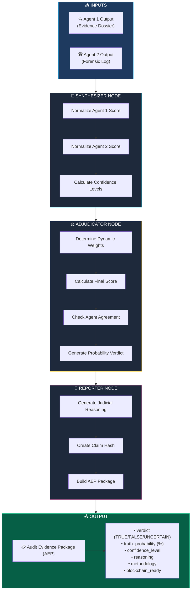
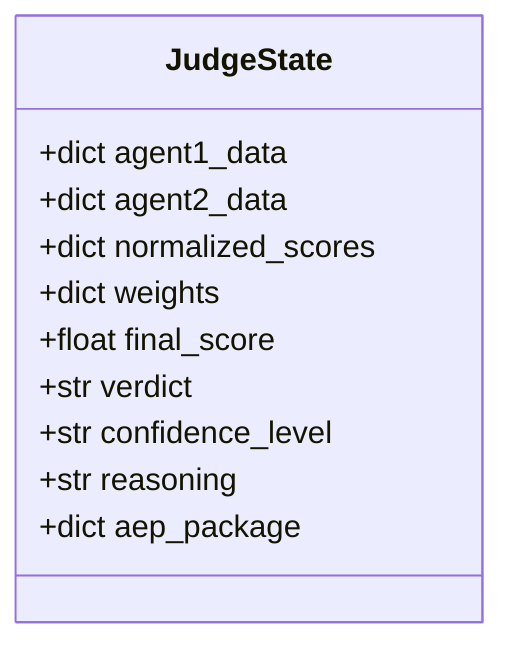
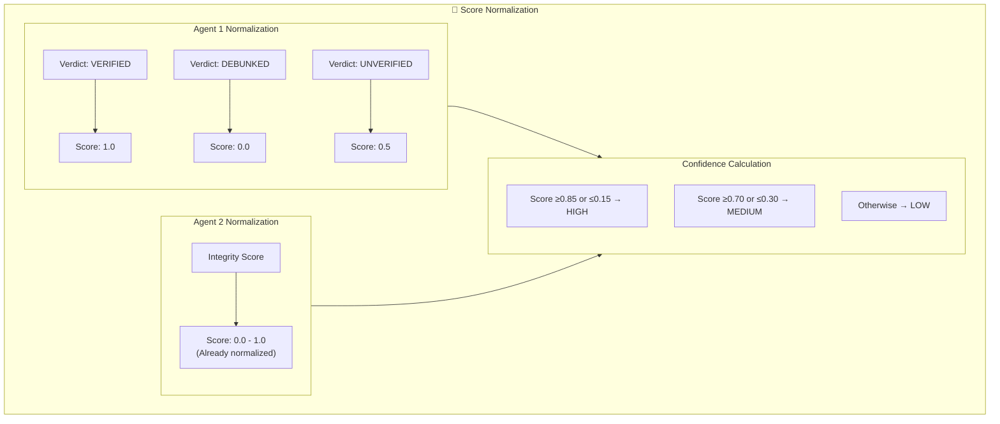
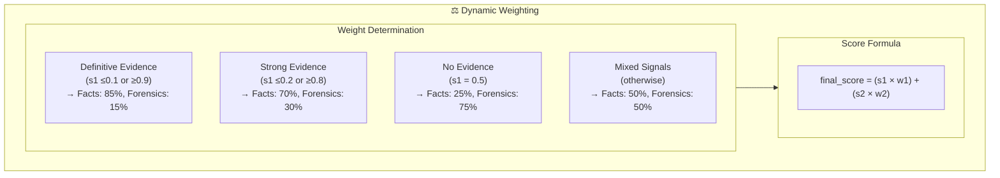
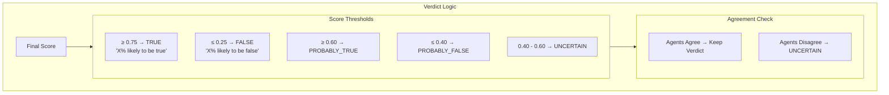
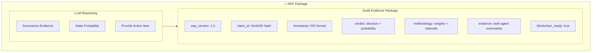
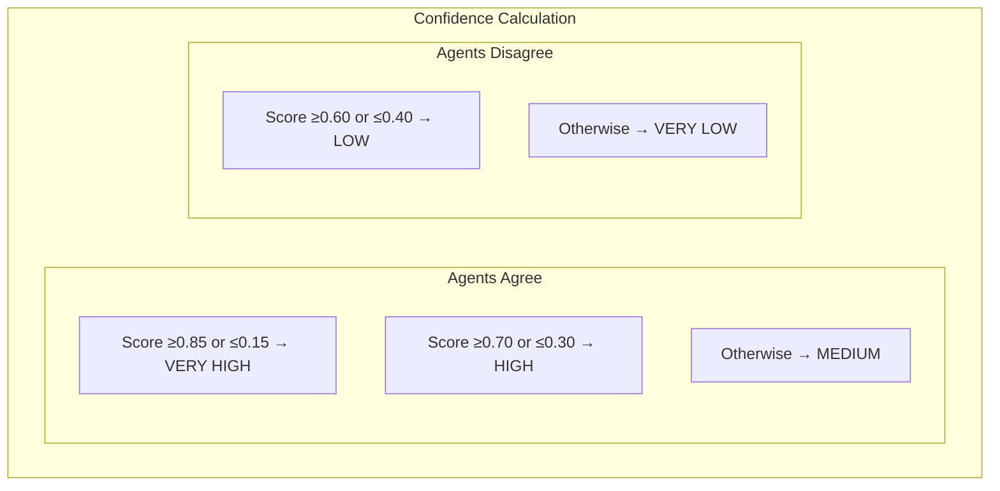
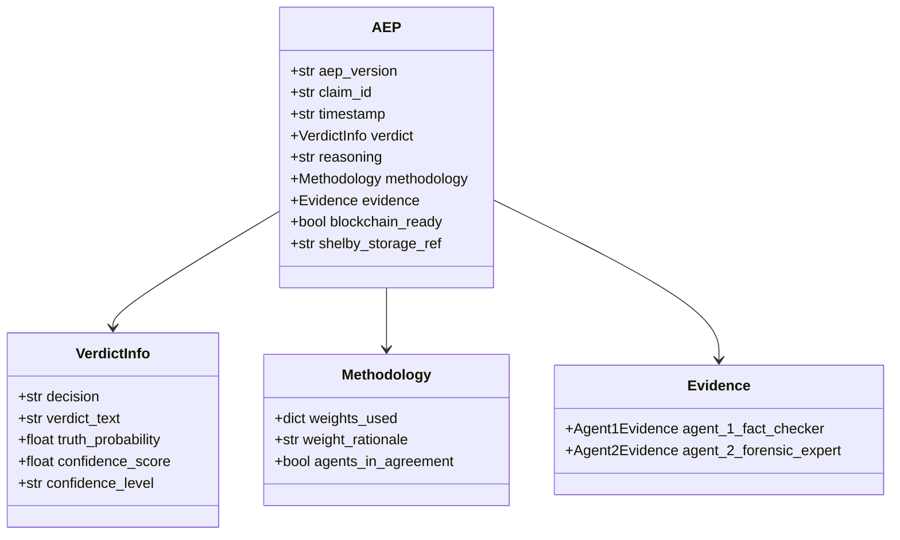

# ⚖️ Agent 3: The Judge

The final arbiter that synthesizes evidence from both agents and renders a probability-based verdict.

## Workflow Diagram



## State Schema



## Node Details

### 1️⃣ Synthesizer Node (Score Normalization)



### 2️⃣ Adjudicator Node (Trust-Weighted Consensus)



### 3️⃣ Verdict Determination



### 4️⃣ Reporter Node (AEP Generation)



## Dynamic Weight System

```mermaid
flowchart LR
    subgraph WEIGHTS["Dynamic Weight Selection"]
        direction TB
        
        subgraph SCENARIO1["Strong Fact Evidence"]
            S1A["Agent 1: VERIFIED/DEBUNKED"]
            S1B["Weight: 85% Facts, 15% Forensics"]
            S1A --> S1B
        end
        
        subgraph SCENARIO2["Moderate Evidence"]
            S2A["Agent 1: Leaning one way"]
            S2B["Weight: 70% Facts, 30% Forensics"]
            S2A --> S2B
        end
        
        subgraph SCENARIO3["No Fact Evidence"]
            S3A["Agent 1: UNVERIFIED"]
            S3B["Weight: 25% Facts, 75% Forensics"]
            S3A --> S3B
        end
        
        subgraph SCENARIO4["Mixed Signals"]
            S4A["Conflicting indicators"]
            S4B["Weight: 50% Facts, 50% Forensics"]
            S4A --> S4B
        end
    end
```



## Confidence Level Matrix



## AEP (Audit Evidence Package) Structure



## Sample Verdict Output

```
┌─────────────────────────────────────────────────────┐
│  ⚖️ THE JUDGE - Final Verdict                      │
├─────────────────────────────────────────────────────┤
│                                                     │
│  Verdict: 78% likely FALSE                          │
│  Confidence: HIGH                                   │
│                                                     │
│  Reasoning:                                         │
│  "This claim is 78% likely to be false based on    │
│   contradicting evidence from Reuters and AP.       │
│   Verify with official company statements before    │
│   taking any action."                               │
│                                                     │
│  📋 AEP Generated: claim_abc123...                 │
│  ⛓️ Blockchain Ready: Yes                          │
│                                                     │
└─────────────────────────────────────────────────────┘
```
